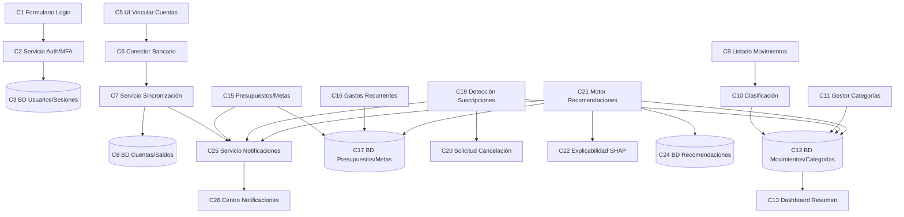

# Laboratorio 2 — Especificaciones de la App: Fynk
**Agente financiero para centralización de cuentas bancarias, control financiero y recomendaciones con IA**

---

## Parte A — 2.1 Mapa de Componentes v1

### Módulos principales

- **M1: Autenticación y Perfil** — registro, login, MFA, recuperación, perfil, eliminación de cuenta.
- **M2: Cuentas Bancarias** — vinculación, consentimiento, sincronización, consulta de saldos.
- **M3: Movimientos y Categorías** — registro, clasificación, categorías compartidas, búsqueda, duplicados, resumen y tendencias.
- **M4: Presupuestos y Metas** — presupuestos, límites, metas de ahorro, gastos recurrentes.
- **M5: Suscripciones** — registro, detección automática, panel, cancelación.
- **M6: Inteligencia Artificial** — análisis financiero, recomendaciones de ahorro/inversión, explicabilidad, retroalimentación.
- **M7: Notificaciones y Soporte** — centro de notificaciones, preferencias, soporte, administración.

### Componentes por módulo

**M1 — Autenticación y Perfil**
- C1: Formulario Registro/Login (UI)
- C2: Servicio de Autenticación y MFA (Servicio)
- C3: Base de Datos de Usuarios y Sesiones (Datos)
- C4: Pantalla de Perfil (UI)

**M2 — Cuentas Bancarias**
- C5: Pantalla de Vinculación de Cuentas (UI)
- C6: Conector Bancario / Open Finance (Integración)
- C7: Servicio de Sincronización (Servicio)
- C8: Base de Datos de Cuentas y Saldos (Datos)

**M3 — Movimientos y Categorías**
- C9: Listado y Filtro de Movimientos (UI)
- C10: Servicio de Clasificación de Movimientos (Servicio)
- C11: Gestor de Categorías (Servicio)
- C12: Base de Datos de Movimientos y Categorías (Datos)
- C13: Dashboard de Resumen Financiero (UI)

**M4 — Presupuestos y Metas**
- C14: Pantalla de Presupuestos/Metas (UI)
- C15: Servicio de Seguimiento de Presupuestos y Metas (Servicio)
- C16: Motor de Gastos Recurrentes (Servicio)
- C17: Base de Datos de Presupuestos/Metas (Datos)

**M5 — Suscripciones**
- C18: Panel de Suscripciones (UI)
- C19: Servicio de Detección de Suscripciones (Servicio)
- C20: Servicio de Solicitud de Cancelación (Integración)

**M6 — Inteligencia Artificial**
- C21: Motor de Recomendaciones (Servicio)
- C22: Módulo de Explicabilidad (SHAP) (Servicio)
- C23: Pantalla de Recomendaciones (UI)
- C24: Base de Datos de Recomendaciones e Historial (Datos)

**M7 — Notificaciones y Soporte**
- C25: Servicio de Notificaciones (Servicio)
- C26: Centro de Notificaciones (UI)
- C27: Panel de Soporte/Administración (UI + Servicio)

### Dependencias principales

- C1 → C2 (formulario login → servicio auth)
- C2 → C3 (auth → BD de usuarios/sesiones)
- C5 → C6 (vinculación → conector bancario)
- C6 → C7 → C8 (conector → sincronización → BD cuentas)
- C9 → C10 → C12 (movimientos → clasificación → BD)
- C11 → C12 (categorías → BD, consumido también por C14, C18, C21)
- C13 ← C12 (dashboard consume BD de movimientos)
- C15 → C17 (presupuestos/metas → BD)
- C16 → C17 (gastos recurrentes → BD)
- C19 → C12 (detección de suscripciones analiza movimientos)
- C19 → C20 (suscripción detectada → cancelación)
- C21 → C12, C17 (recomendaciones consumen movimientos y presupuestos)
- C21 → C22 (recomendación → explicabilidad)
- C21 → C24 (recomendación → historial)
- C25 → C26 (servicio → centro de notificaciones), alimentado por C7, C15, C19, C21

### Diagrama de dependencias (componentes MVP)

### Notas

- **Incluye en MVP:** C1–C13, C15, C17 (presupuestos básicos), C18–C19 (panel + detección de suscripciones), C21–C24 (recomendaciones con explicación básica), C25–C26.
- **Futuro:** finanzas compartidas (RN-01), cancelación automática con proveedores (RF-47 avanzado), reentrenamiento continuo (RNF-41), auditoría avanzada (C27 ampliado).

---

## Parte B — 2.2 Especificaciones de Componentes Críticos

### Componente 1: Servicio de Autenticación y MFA (C2)

**Tipo:** Servicio
**Propósito:** Gestionar el registro, inicio de sesión, segundo factor y recuperación de acceso de forma segura.
**Historias de usuario relacionadas:** HU-01, HU-02, HU-03, HU-04

**Entradas:**

| Campo | Tipo/Formato | Obligatorio | Rango/Regla de validación |
|---|---|---|---|
| correo | string, formato email (RFC 5322) | Sí | Único en el sistema |
| contraseña | string | Sí | Mín. 8 caracteres, 1 mayúscula, 1 número, 1 símbolo |
| cédula | string numérico | Sí | 6–10 dígitos, formato válido según país |
| teléfono | string, formato E.164 | Sí | Ej. +57XXXXXXXXXX |
| código_MFA | string numérico | Condicional (si no usa biometría) | 6 dígitos, vigencia 5 min |
| biometría | booleano (resultado del SO) | Condicional (si no usa código) | true/false |

**Salidas:**

| Campo | Tipo/Formato | Obligatorio |
|---|---|---|
| token_sesión | JWT, vigencia 30 min (renovable) | Sí, si autenticación exitosa |
| estado | enum: `exitoso`, `credenciales_invalidas`, `mfa_requerido`, `bloqueado` | Sí |
| causa_error | string (solo si estado ≠ exitoso) | Condicional |

**Reglas de negocio:**
- Contraseña debe cumplir política de seguridad (RF-02).
- MFA vía código temporal (SMS/correo) o biometría del dispositivo; no requiere app externa (RF-04).
- Tokens deben poder revocarse ante cierre de sesión, cambio de contraseña o actividad sospechosa (RNF-04).

**Flujo principal:**
1. Usuario ingresa credenciales.
2. Sistema valida formato y existencia de cuenta.
3. Sistema solicita segundo factor.
4. Usuario confirma con código/biometría.
5. Sistema emite token de sesión y registra el acceso.

**Requisitos no funcionales (RNF — formato SMART):**
- Rendimiento: el 95 % de las solicitudes de login deben responder en ≤ 3 segundos, medido en producción bajo carga normal (RNF-13).
- Seguridad: toda credencial y token deben cifrarse con AES-256 en reposo y TLS 1.2+ en tránsito (RNF-01); el sistema debe bloquear una cuenta tras 5 intentos fallidos consecutivos en un lapso de 10 minutos (RNF-05).
- Accesibilidad: el 100 % de los campos del formulario deben tener etiqueta ARIA y ser navegables con lector de pantalla, verificable con auditoría automatizada (RNF-23).

**Criterios de aceptación:**
- Dado un usuario con credenciales válidas, cuando inicia sesión, entonces el sistema solicita un segundo factor antes de emitir el token.
- Dado un intento fallido de MFA tres veces consecutivas, cuando el usuario reintenta, entonces el sistema bloquea temporalmente el acceso y notifica por seguridad (RF-62).
- Dado un cambio de contraseña, cuando se confirma, entonces todos los tokens activos anteriores se revocan.
- **(Caso de error)** Dado un código MFA expirado (>5 min desde su emisión), cuando el usuario lo ingresa, entonces el sistema rechaza el código, indica que expiró y ofrece reenviar uno nuevo sin bloquear la cuenta.

---

### Componente 2: Conector Bancario / Open Finance (C6)

**Tipo:** Integración
**Propósito:** Vincular cuentas bancarias externas del usuario mediante un proveedor autorizado de Open Finance.
**Historias de usuario relacionadas:** HU-07, HU-08, HU-09, HU-13

**Entradas:**

| Campo | Tipo/Formato | Obligatorio | Rango/Regla de validación |
|---|---|---|---|
| entidad_bancaria_id | string (catálogo del proveedor Open Finance) | Sí | Debe existir en el catálogo soportado |
| autorización_usuario | OAuth2 authorization code (entregado por el proveedor) | Sí | Vigencia según política del banco |
| alcance_consentimiento | enum: `solo_saldo`, `saldo_y_movimientos` | Sí | Definido antes de autorizar |
| vigencia_consentimiento | fecha ISO 8601 | Sí | Máx. 180 días (renovable) |

**Salidas:**

| Campo | Tipo/Formato | Obligatorio |
|---|---|---|
| token_acceso_bancario | string cifrado (almacenado en Keystore/Keychain) | Sí, si autorización exitosa |
| entidad, tipo_cuenta, id_parcial | string | Sí |
| saldo_disponible | decimal, 2 posiciones, moneda ISO 4217 | Sí |
| estado_vinculación | enum: `activa`, `pendiente`, `error`, `expirada` | Sí |

**Reglas de negocio:**
- Fynk no almacena credenciales bancarias directamente (RNF-02).
- Se debe informar al usuario qué datos se consultan, la finalidad y vigencia antes de conectar (RF-10).
- Ante expiración o revocación del consentimiento, se solicita renovación (RF-15).

**Flujo principal:**
1. Usuario selecciona su entidad bancaria.
2. Sistema muestra el consentimiento informado (datos, finalidad, vigencia).
3. Usuario autoriza mediante el flujo del proveedor externo.
4. Sistema recibe y almacena de forma segura el token de acceso.
5. Sistema confirma la vinculación y dispara la primera sincronización.

**Requisitos no funcionales (RNF — formato SMART):**
- Seguridad: el 100 % de los tokens de acceso deben almacenarse cifrados en Keystore (Android) o Keychain (iOS), nunca en almacenamiento plano ni en logs (RNF-02).
- Disponibilidad: si el proveedor externo no responde en 10 segundos, el sistema debe mostrar los últimos datos sincronizados junto con su fecha, sin bloquear la interfaz (RNF-17).
- Privacidad: el consentimiento de conexión bancaria debe poder revocarse independientemente del consentimiento de recomendaciones de IA, en menos de 2 pasos desde el perfil (RNF-09).

**Criterios de aceptación:**
- Dado un usuario que inicia la vinculación, cuando llega a la pantalla de autorización, entonces el sistema muestra explícitamente los datos, la finalidad y la vigencia del acceso antes de continuar.
- Dado un proveedor externo caído, cuando el usuario abre la app, entonces se muestran los últimos datos sincronizados con su fecha correspondiente.
- Dado un consentimiento expirado, cuando el usuario intenta sincronizar, entonces el sistema solicita renovar la autorización antes de continuar.
- **(Caso de error)** Dado que el usuario cancela o rechaza la autorización en el flujo del proveedor externo, cuando regresa a Fynk, entonces el sistema no crea una cuenta vinculada y muestra un mensaje indicando que la vinculación no se completó.

---

### Componente 3: Servicio de Sincronización (C7)

**Tipo:** Servicio
**Propósito:** Mantener actualizados saldos y movimientos de las cuentas vinculadas, de forma automática y bajo demanda.
**Historias de usuario relacionadas:** HU-09, HU-10, HU-11

**Entradas:**

| Campo | Tipo/Formato | Obligatorio | Rango/Regla de validación |
|---|---|---|---|
| token_acceso_bancario | string (referencia a C6) | Sí | Debe estar vigente (no expirado/revocado) |
| tipo_solicitud | enum: `automática`, `manual` | Sí | — |
| cuenta_id | UUID | Sí | Debe existir y pertenecer al usuario autenticado |

**Salidas:**

| Campo | Tipo/Formato | Obligatorio |
|---|---|---|
| saldo_actualizado | decimal, 2 posiciones | Sí, si éxito |
| movimientos_nuevos | array de objetos movimiento (fecha, monto, comercio, tipo) | Sí, si existen |
| fecha_última_sincronización | fecha/hora ISO 8601 | Sí |
| estado_sincronización | enum: `exitosa`, `parcial`, `fallida` | Sí |
| causa_error | string (código + descripción), solo si estado ≠ exitosa | Condicional |

**Reglas de negocio:**
- La sincronización se ejecuta en segundo plano mediante cola de mensajería para garantizar consistencia eventual (RNF-15).
- No debe generar duplicados ni pérdidas de información (RNF-19).
- Un movimiento importado no se elimina; solo se oculta, excluye o reclasifica (RN-02).

**Flujo principal:**
1. Sistema dispara sincronización (automática o manual).
2. Se consulta al conector bancario (C6) por datos nuevos.
3. Se detectan y filtran posibles duplicados (RF-24).
4. Se actualizan saldos y movimientos en la base de datos.
5. Se notifica al usuario el resultado (éxito o error con causa).

**Requisitos no funcionales (RNF — formato SMART):**
- Disponibilidad: el servicio de sincronización debe tener una disponibilidad del 99.9 % anual, con un tiempo de inactividad máximo acumulado de 8.76 horas al año, medido por el monitoreo de RNF-33 (RNF-16, RNF-17).
- Rendimiento: el procesamiento asíncrono vía cola de mensajería (ej. RabbitMQ) debe garantizar que el 95 % de las sincronizaciones automáticas se completen en menos de 60 segundos desde el disparo del evento (RNF-15).
- Confiabilidad: cero pérdidas de movimientos confirmadas ante caída de red durante la sincronización, verificado mediante reconciliación diaria automática (RNF-19).

**Criterios de aceptación:**
- Dado que una cuenta no puede sincronizarse, cuando ocurre el error, entonces el sistema muestra la causa conocida y una acción de solución.
- Dado un mismo movimiento recibido dos veces, cuando se procesa la sincronización, entonces el sistema lo identifica como posible duplicado y no lo cuenta dos veces en los totales.
- Dado que el usuario solicita sincronización manual, cuando la ejecuta, entonces el sistema actualiza la fecha de última sincronización visible en la pantalla de cuentas.
- **(Caso de error)** Dado que la cola de mensajería no puede procesar la sincronización por caída del servicio, cuando el usuario reintenta, entonces la solicitud queda encolada y se reintenta automáticamente hasta 3 veces antes de marcar la sincronización como fallida.

---

### Componente 4: Gestor de Categorías (C11)

**Tipo:** Servicio
**Propósito:** Administrar categorías personalizadas y garantizar su disponibilidad consistente en todos los módulos.
**Historias de usuario relacionadas:** HU-16, HU-17, HU-18, HU-19

**Entradas:**

| Campo | Tipo/Formato | Obligatorio | Rango/Regla de validación |
|---|---|---|---|
| nombre_categoría | string | Sí | 1–40 caracteres, único por usuario |
| ícono/color | string (código hex o ID de ícono) | No | Valor por defecto si se omite |
| acción | enum: `crear`, `editar`, `desactivar`, `eliminar` | Sí | — |
| categoría_destino_reasignación | UUID | Condicional (solo si acción = `eliminar` y hay uso) | Debe ser una categoría existente y activa |

**Salidas:**

| Campo | Tipo/Formato | Obligatorio |
|---|---|---|
| lista_categorías_activas | array de objetos {id, nombre, ícono, en_uso} | Sí |
| resultado | enum: `guardado`, `advertencia_en_uso`, `error_duplicado` | Sí |

**Reglas de negocio:**
- Las categorías creadas por el usuario deben estar disponibles en todos los módulos que las consumen (RF-21).
- Si una categoría está en uso, se debe advertir antes de eliminarla y permitir reasignación (RF-22).
- Las categorías generales del administrador no deben modificar las categorías personales del usuario (RF-64).

**Flujo principal:**
1. Usuario crea o edita una categoría.
2. Sistema valida nombre único dentro del espacio del usuario.
3. Sistema guarda la categoría y la publica a los módulos dependientes.
4. Si se solicita eliminar una categoría en uso, el sistema advierte y ofrece reasignación.
5. Usuario confirma o cancela la acción.

**Requisitos no funcionales (RNF — formato SMART):**
- Usabilidad: los mensajes de advertencia al eliminar deben usar lenguaje sin tecnicismos, verificado con prueba de comprensión con usuarios reales (tasa de comprensión ≥ 90 %) (RNF-22).
- Prevención de errores: el 100 % de las eliminaciones de categorías en uso deben requerir confirmación explícita de dos pasos (advertencia + confirmar) (RNF-24).
- Consistencia: una categoría nueva o editada debe reflejarse en todos los módulos dependientes (movimientos, presupuestos, suscripciones, recomendaciones) en un máximo de 2 segundos tras guardarse (RNF-30).

**Criterios de aceptación:**
- Dado que una categoría tiene movimientos asociados, cuando el usuario intenta eliminarla, entonces el sistema advierte el impacto y solicita reasignar los registros antes de confirmar.
- Dado que el usuario crea una nueva categoría, cuando la guarda, entonces esta aparece disponible inmediatamente en movimientos, presupuestos y suscripciones.
- **(Caso de error)** Dado que el usuario intenta crear una categoría con un nombre ya existente en su espacio, cuando confirma, entonces el sistema rechaza la operación con el estado `error_duplicado` y no crea un registro nuevo.

---

### Componente 5: Motor de Recomendaciones (C21)

**Tipo:** Servicio
**Propósito:** Analizar el comportamiento financiero del usuario y generar recomendaciones personalizadas de ahorro e inversión.
**Historias de usuario relacionadas:** HU-46, HU-47, HU-48, HU-49, HU-52, HU-53

**Entradas:**

| Campo | Tipo/Formato | Obligatorio | Rango/Regla de validación |
|---|---|---|---|
| historial_movimientos | array de objetos movimiento (últimos 12 meses) | Sí | Mínimo 30 días de datos para generar recomendación válida |
| perfil_financiero.objetivo | enum: `ahorro`, `inversión`, `reducción_deuda` | Sí | — |
| perfil_financiero.tolerancia_riesgo | enum: `bajo`, `medio`, `alto` | Sí | — |
| perfil_financiero.horizonte_temporal | entero (meses) | Sí | 1–360 |

**Salidas:**

| Campo | Tipo/Formato | Obligatorio |
|---|---|---|
| recomendación.motivo | string | Sí |
| recomendación.datos_considerados | array de referencias a movimientos/presupuestos | Sí |
| recomendación.riesgos | string | Sí, si tipo = inversión |
| recomendación.acción_sugerida | string | Sí |
| versión_modelo | string (semver, ej. "v2.3.1") | Sí |
| fecha_corte_datos | fecha ISO 8601 | Sí |

**Reglas de negocio:**
- Ninguna recomendación garantiza rendimientos (RN-05).
- La IA no ejecuta operaciones financieras sin autorización explícita (RN-06, RF-57).
- Cada recomendación se asocia a la versión del modelo y a los datos usados (RN-04, RNF-35).
- Si los datos son insuficientes, se debe comunicar la limitación sin dar conclusiones definitivas (RNF-40).

**Flujo principal:**
1. Sistema recopila datos financieros relevantes del usuario.
2. Motor de IA analiza patrones, capacidad de ahorro y perfil de riesgo.
3. Se genera la recomendación con su justificación (vía módulo de explicabilidad, C22).
4. Usuario visualiza y decide: aceptar, rechazar o posponer.
5. Sistema registra la decisión y, si aplica, solicita confirmación adicional antes de ejecutar cualquier acción.

**Requisitos no funcionales (RNF — formato SMART):**
- Explicabilidad: el 100 % de las recomendaciones basadas en modelos predictivos deben incluir al menos las 3 variables de mayor peso (vía SHAP), presentadas en lenguaje no técnico (RNF-34).
- Trazabilidad: toda recomendación debe registrar fecha, versión del modelo y hash de los datos de entrada, consultable en el historial en menos de 2 segundos (RNF-35).
- Monitoreo de modelo: el sistema debe evaluar el desempeño del modelo (data drift) al menos una vez por trimestre, y disparar reentrenamiento si la precisión cae más de 5 puntos porcentuales respecto a la línea base (RNF-41).

**Criterios de aceptación:**
- Dado que el sistema genera una recomendación de inversión, cuando se muestra al usuario, entonces incluye motivo, riesgos, beneficio esperado y advertencia de que no garantiza rentabilidad.
- Dado que el usuario acepta una recomendación de acción financiera, cuando confirma, entonces el sistema solicita una confirmación adicional explícita antes de ejecutar cualquier transferencia o contratación.
- Dado que los datos del usuario son insuficientes, cuando se solicita una recomendación, entonces el sistema informa la limitación en vez de emitir una conclusión definitiva.
- **(Caso de error)** Dado que el usuario tiene menos de 30 días de historial financiero registrado, cuando solicita una recomendación, entonces el sistema no genera una recomendación de inversión y explica que necesita más datos para hacerlo con confianza.

---

### Componente 6: Servicio de Detección de Suscripciones (C19)

**Tipo:** Servicio
**Propósito:** Identificar cobros recurrentes en los movimientos del usuario y apoyar su gestión o cancelación.
**Historias de usuario relacionadas:** HU-40, HU-42, HU-43, HU-44

**Entradas:**

| Campo | Tipo/Formato | Obligatorio | Rango/Regla de validación |
|---|---|---|---|
| movimientos_históricos | array de movimientos (mín. 60 días) | Sí | Se requieren ≥ 2 ocurrencias del mismo comercio/monto para proponer detección |
| confirmación_usuario | booleano | Sí (en la etapa de confirmación) | true = confirma, false = descarta |
| solicitud_cancelación | booleano | No | Disparada solo si el usuario la solicita explícitamente |

**Salidas:**

| Campo | Tipo/Formato | Obligatorio |
|---|---|---|
| suscripción.nombre, valor, periodicidad | string / decimal / enum (`mensual`,`anual`,`semanal`) | Sí |
| suscripción.próxima_fecha_cobro | fecha ISO 8601 | Sí |
| estado_cancelación | enum: `no_solicitada`, `enviada`, `canal_manual`, `confirmada` | Sí |

**Reglas de negocio:**
- El sistema analiza movimientos para identificar posibles cobros recurrentes (RF-43); requiere confirmación del usuario (RF-44).
- Si el proveedor lo permite, se envía solicitud de cancelación automática; si no, se muestra el canal oficial o instrucciones (RF-47).
- El estado de la cancelación debe quedar registrado y confirmable por el usuario (RF-48).

**Flujo principal:**
1. Sistema analiza movimientos recurrentes por monto, periodicidad y comercio.
2. Sistema propone una suscripción detectada.
3. Usuario confirma o descarta la propuesta.
4. Si el usuario solicita cancelar, el sistema envía la solicitud o muestra el canal oficial.
5. Sistema registra el estado y notifica antes de cada renovación futura (RF-46).

**Requisitos no funcionales (RNF — formato SMART):**
- Rendimiento: el análisis de detección debe ejecutarse en segundo plano y completarse en menos de 5 minutos tras cada sincronización, vía cola de mensajería (RNF-15).
- Usabilidad: el estado de cada suscripción (detectada, confirmada, cancelación en curso) debe ser visible mediante un indicador visual distinto en el 100 % de los casos en el panel de suscripciones (RNF-25).
- Precisión: la tasa de falsos positivos en la detección automática debe mantenerse por debajo del 10 %, medida trimestralmente contra confirmaciones/descartes reales del usuario.

**Criterios de aceptación:**
- Dado un patrón de cobro recurrente detectado, cuando el sistema lo identifica, entonces lo presenta al usuario para confirmar o descartar, sin registrarlo automáticamente como definitivo.
- Dado que el proveedor no permite cancelación automática, cuando el usuario solicita cancelar, entonces el sistema muestra el canal oficial o las instrucciones disponibles.
- Dado que una suscripción está próxima a renovarse, cuando falta el plazo configurado, entonces el sistema envía una alerta previa al usuario.
- **(Caso de error)** Dado que el usuario descarta una suscripción detectada por error del algoritmo, cuando confirma el descarte, entonces el sistema no vuelve a proponerla para el mismo comercio y monto en los siguientes 90 días.

---

### Componente 7: Servicio de Notificaciones (C25)

**Tipo:** Servicio
**Propósito:** Centralizar y entregar alertas relevantes de todos los módulos (presupuestos, metas, suscripciones, sincronización, IA, seguridad).
**Historias de usuario relacionadas:** HU-55, HU-56, HU-57

**Entradas:**

| Campo | Tipo/Formato | Obligatorio | Rango/Regla de validación |
|---|---|---|---|
| evento.tipo | enum: `presupuesto`, `meta`, `suscripción`, `sincronización`, `IA`, `seguridad` | Sí | — |
| evento.severidad | enum: `informativa`, `advertencia`, `crítica` | Sí | `seguridad` siempre es `crítica` |
| preferencias_usuario | mapa {tipo_evento: booleano} | Sí | Todos en `true` por defecto salvo `seguridad` (no configurable) |

**Salidas:**

| Campo | Tipo/Formato | Obligatorio |
|---|---|---|
| notificación.título, cuerpo | string (máx. 120 caracteres el título) | Sí, si se envía |
| canal | enum: `push`, `in-app`, `ambos` | Sí |
| registro_historial | objeto {fecha, tipo, leída: booleano} | Sí |

**Reglas de negocio:**
- El usuario debe poder configurar qué tipos de alerta recibir (RF-61).
- Las alertas de seguridad son obligatorias e informan accesos nuevos y cambios sensibles (RF-62).
- El historial de notificaciones debe quedar disponible para consulta posterior (RF-60).

**Flujo principal:**
1. Un módulo origen genera un evento (ej. presupuesto al 90 %).
2. Servicio de notificaciones valida las preferencias del usuario para ese tipo de alerta.
3. Si está habilitada, se genera y envía la notificación.
4. Se registra en el centro de notificaciones.
5. Usuario consulta o descarta la notificación desde la app.

**Requisitos no funcionales (RNF — formato SMART):**
- Rendimiento: una notificación debe generarse y encolarse en menos de 2 segundos desde que el módulo origen dispara el evento, mediante procesamiento asíncrono desacoplado (RNF-15, RNF-30).
- Seguridad: las alertas de tipo `seguridad` deben enviarse en el 100 % de los casos, sin excepción y sin posibilidad de desactivación por el usuario (RNF-06).
- Usabilidad: el 100 % de los mensajes deben evitar tecnicismos y no superar 120 caracteres en el título, validado en revisión de contenido (RNF-22).

**Criterios de aceptación:**
- Dado que el usuario desactiva las alertas de presupuesto, cuando se alcanza un límite, entonces no recibe notificación de ese tipo, pero el evento queda registrado en el sistema.
- Dado un acceso desde un dispositivo nuevo, cuando ocurre, entonces el sistema envía una alerta de seguridad sin importar las preferencias configuradas.
- Dado que el usuario abre el centro de notificaciones, cuando consulta el historial, entonces puede ver todas las alertas anteriores ordenadas por fecha.
- **(Caso de error)** Dado que el servicio de envío push está temporalmente caído, cuando se genera una notificación crítica de seguridad, entonces el sistema la registra igualmente en el centro de notificaciones in-app y reintenta el envío push cuando el servicio se restablezca.

---

## Trazabilidad HU → Componentes (resumen)

*Historias de usuario según el documento "Fynk_Historias_Usuario" (62 HU derivadas de los RF aprobados).*

| Historia de Usuario | Componente(s) que la cubre |
|---|---|
| HU-01 Registro de usuario | C1, C2, C3 |
| HU-02 Login con MFA | C1, C2 |
| HU-03 Recuperar acceso | C2 |
| HU-04 Cierre automático de sesión | C2, C3 |
| HU-07 Vincular cuentas bancarias | C5, C6 |
| HU-08 Consentimiento informado | C5, C6 |
| HU-09 Consultar cuentas vinculadas | C6, C7, C8, C13 |
| HU-10 Sincronización automática/manual | C7, C8 |
| HU-11 Error de sincronización | C7 |
| HU-13 Renovación de consentimiento | C6 |
| HU-16 Clasificación de movimientos | C10, C12 |
| HU-17 Crear/editar categorías | C11 |
| HU-18 Categorías compartidas entre módulos | C11, C12 |
| HU-19 Integridad al eliminar categorías | C11 |
| HU-40 Detección automática de suscripciones | C19 |
| HU-42 Alerta previa a renovación | C19, C25 |
| HU-43 Apoyo a cancelación | C19, C20 |
| HU-44 Estado de cancelación | C19, C20 |
| HU-46 Recomendaciones de ahorro | C21, C23 |
| HU-47 Recomendaciones de inversión ajustadas al perfil | C21 |
| HU-48 Explicación de la recomendación | C21, C22, C23 |
| HU-49 Aceptar/rechazar/posponer recomendación | C21, C23, C24 |
| HU-52 Control de ejecución (sin acción automática) | C21 |
| HU-53 Advertencias de riesgo en inversión | C21, C23 |
| HU-55 Historial de notificaciones | C25, C26 |
| HU-56 Preferencias de notificación | C25, C26 |
| HU-57 Alertas de seguridad | C25, C26, C2 |

*Nota: la tabla anterior cubre las historias vinculadas a los 7 componentes críticos especificados en la Parte B. El listado completo de las 62 historias de usuario, organizado por los 7 módulos, está disponible en el documento "Fynk_Historias_Usuario".*

---

## Registro de mejoras aplicadas (v2)

A partir de la retroalimentación recibida (91/100), se aplicaron las siguientes mejoras a este documento:

1. **Entradas/Salidas detalladas:** los 7 componentes ahora especifican tipo de dato, formato, obligatoriedad y rango/regla de validación en tablas, en lugar de listas generales.
2. **RNF en formato SMART:** los RNF de los 7 componentes se reescribieron con métricas cuantificables (porcentajes, tiempos máximos, umbrales), incluyendo el ejemplo sugerido de disponibilidad (99.9 % anual, máx. 8.76 h/año de inactividad) aplicado en el Servicio de Sincronización (C7).
3. **Casos de borde/error en criterios de aceptación:** se añadió un criterio adicional de error o caso límite por componente (identificado como "Caso de error"), sumando 7 criterios nuevos a los 21 originales — **28 criterios de aceptación en total**.
4. **Diagrama visual de dependencias:** se incorporó un diagrama Mermaid en la Parte A que representa gráficamente las dependencias entre los componentes del MVP.
